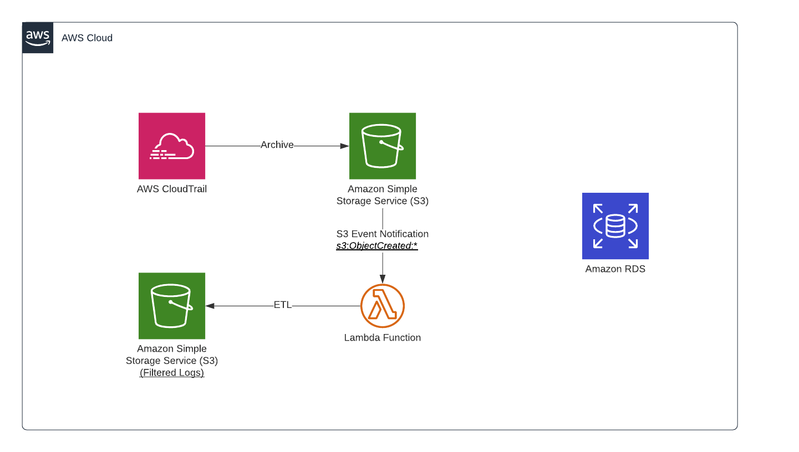

# CloudTrail Log Filtering using Lambda

## Architecture


## Prepare `terraform.tfvars`
```
$ cp example.tfvars terraform.tfvars
```
Modify values in terraform.tfvars according to your environment

## Execute `terraform`
```sh
terraform init
terraform plan
terraform apply
```

## Remarks
* CloudTrail has a delay of ~15 minutes